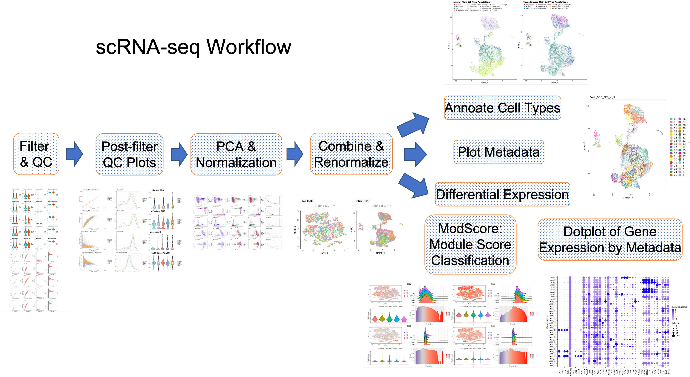

# SCWorkflow
Workflow Package for Analysis of Single Cell Data

The Single Cell Workflow streamlines the analysis of multimodal Single Cell RNA-Seq data produced from 10x Genomics.  It can be run in a docker container, and for biologists, in user-friendly web-based interactive notebooks (NIDAP, Palantir Foundry). It is based on the Seurat workflow in Bioconductor.

It has been tested on several single cell datasets. The main workflow is  these steps: 

